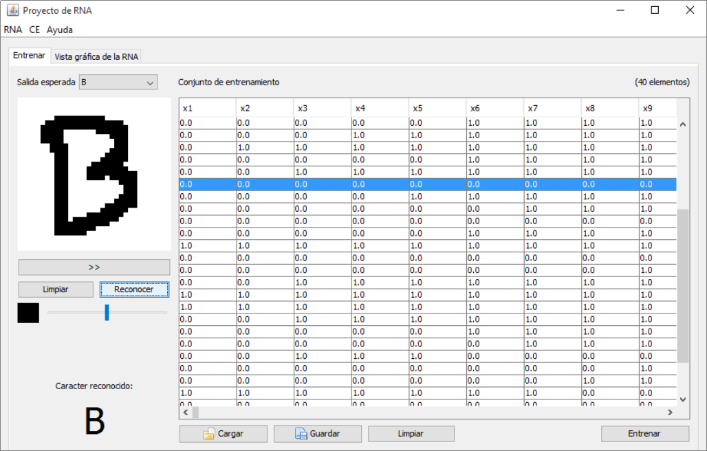
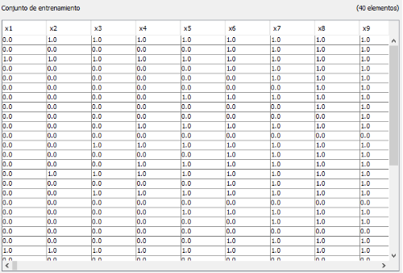

# B or D character recognizer

This was my first patterns recognition project using neural networks, its goal was to recognice a B or D letters in a user input.
The algorithm used is multilayer perceptron with backpropagation.

I used an input layer of 1024 neurons (the equivalent to 32x32 input pixedes, corresponding to the user drawing input).
In the intermediate layer were used 28 neurons. Output layer consists of two neurons, the y1 and y2 corresponding to
letter "B" and "D" respectively.

The input is transformed to binary notation (0 => white pixel, 1 => black pixel)

# Training set

The training set used is formed by 20 patterns corresponding to each letter (a total of 40 patterns).
This training set is located in `sets/trainingSet.ser` and can be loaded into the GUI.

A previously trained MLP network is available under `trained/mpl.ser` and can be also loaded into the GUI.

# Steps to install

1. Open the project in NetBeans or your preferred Java IDE.
2. Compile & build the project.
3. Open the .jar file generated in the build.
4. Load the training set and train the neural network or just load the previously trained one.
5. Enjoy!

# Footnote

This is an **old** project when I was just **starting** with machine learning and AI. Please, be kind 😉.
I'm uploading this to GitHub without even checking the code first 🧐.